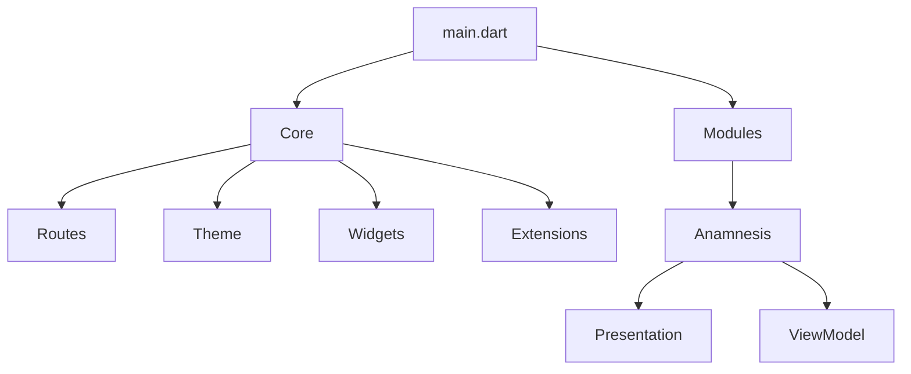
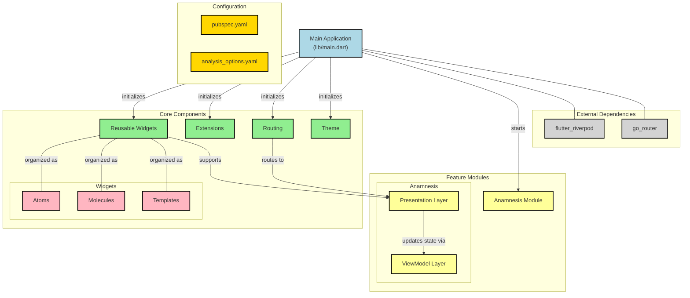

# Demo AFGR - Test Technical Flutter 2025-01

<p align="center">

[](https://github.com/tech-andgar/demo_test_technical_flutter_202501/actions/workflows/build.yml)
![coverage][coverage_badge]
[](https://coveralls.io/github/tech-andgar/demo_test_technical_flutter_202501?branch=main)
[](https://github.com/tech-andgar/demo_test_technical_flutter_202501)

</p>

---

A Flutter application implementing a multi-step form with animations and state management.

https://github.com/user-attachments/assets/41739672-8488-40d2-bd83-dd05675b2b7d

## Setup Requirements

### Environment

- Dart SDK: ^3.6.0
- Flutter: Latest stable version
- IDE: VS Code or Android Studio

### Dependencies

Main packages used:

- flutter_riverpod: ^2.6.1 (State Management)
- go_router: ^14.3.0 (Navigation)

Development dependencies:

- flutter_lints: ^5.0.0
- dart_code_linter: ^1.1.5
- mocktail: ^1.0.4 (Mocking for tests)
- flutter_coverage_badge: (Code coverage badge integration)

## Getting Started

1. Clone the repository:

    ```bash
    git clone https://github.com/tech-andgar/demo_test_technical_flutter_202501.git
    ```

2. Install dependencies:

    ```bash
    flutter pub get
    ```

3. Run the application:

    ```bash
    flutter run
    ```

## Architecture & Technical Decisions

### State Management

The application uses **Riverpod** as the state management solution due to:

- **Type Safety**: Provides compile-time safety and IDE support
- **Dependency Injection**: Easy to manage and inject dependencies
- **Testing**: Facilitates unit testing with mock providers
- **Code Organization**: Clear separation of UI and business logic

### Navigation

- Utilizes **go_router** for declarative routing
- Custom transition animations between screens
- Maintains navigation history for back navigation

### Form Validation

- Real-time validation as the user types
- Required field validation
- Custom toggle buttons for boolean inputs
- Disable/enable navigation based on form validity

### Project Structure

```
lib/
├── core/         /// Contains reusable components, extensions, routing, and theme configuration
│   ├── extensions/
│   ├── routes/
│   ├── theme/
│   └── widgets/  /// Reusable UI components divided into atoms and molecules
├── modules/      /// Feature-based modules containing screens and view models
│   └── anamnesis/
│       ├── presentation/
│       └── view_model/
└── main.dart
```





## Technical Documentation

### Configuration Files

#### analysis_options.yaml

This file defines strict code analysis rules:

- Incorporates Flutter-specific linting rules
- Enforces strict mode for:
  - Type safety
  - Inference
  - Raw types
- Disables implicit casts and dynamic usage
- Includes custom lint rules from dart_code_linter

#### pubspec.yaml

Project configuration file containing:

- Dependencies:
  - flutter_riverpod: State management
  - go_router: Navigation
- Dev dependencies for testing and code quality
- Font configurations for multiple `Futura` font variants

### Core Components

Contains reusable components, routing, and theme configuration.

#### Routes

- **names.dart**: Centralizes route name constants
- **pages.dart**: Configures GoRouter with route definitions
- **page_route_builder.dart**: Implements custom page transitions

#### Theme

- Dark theme configuration
- Consistent typography using custom `Futura` fonts
- Configures custom styles for:
  - Buttons
  - Input fields
  - Toggle buttons

#### Widgets

Organized in atomic design pattern:

- **Atoms**: Basic UI components
  - CustomText: Text with a required field indicator
- **Molecules**: Composite components
  - CustomButton: Reusable button component
  - CustomResponsiveCenter: Reusable responsive child will be centered component
  - CustomToggleButton: Two-state toggle component
  - CustomTemplatePage: Reusable widget template page component

### Code Quality

- Strict static analysis rules
- Comprehensive linting configuration
- Type safety enforcement
- Clear component hierarchy
- Consistent coding patterns

### UI/UX Considerations

1. **Custom Animations**
   - Slide transitions between pages
   - Direction-aware animations

2. **Accessibility**
   - Semantic labels for required fields
   - Clear error states
3. **Typography**
   - Multiple custom `Futura` font variants
   - Consistent text styling through theme

4. **Custom Widgets**
   - `CustomButton`: Reusable button component
   - `CustomResponsiveCenter`: Reusable responsive child will be centered component
   - `CustomToggleButton`: Two-state toggle component
   - `CustomTemplatePage`: Reusable widget template page component
   - `CustomText`: Text with required field indicator

## Testing

### Unit Tests

- Utilizes **mocktail** for dependency mocking
- Clear separation of test files by module

### Coverage Badge

- Configured using **flutter_coverage_badge**
- Generates a code coverage badge for the project

[coverage_badge]: coverage_badge.svg
